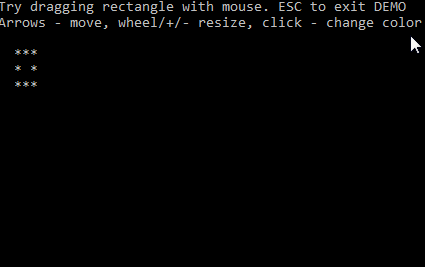

# What is it
rterm is a library to manipulate terminal/console. It is a Rust port of Go library [termbox](https://github.com/nsf/termbox-go)

# Why
There are great libraries to build a TUI-based application. But most of them work only on Linux/OSX and do not support Windows(or only Windows 10). Some of them support any Windows but require extra terminal-emulators, like BearLibTerminal or pdcurses. I wanted to have something simple that can run inside standard console window(cmd.exe).

# Description
At this moment the library works well on Windows(tested on Windows 7) but there is no support of Linux/OSX yet. While the library is quite usable, please see the main [example](./examples/demo.rs) that shows mouse drag/click and key processing in action:

it is still not ready to use in production:
  * The code needs Linux/OSX support
  * The code needs cleanup and refactoring:
    - too many public stuff (hide some of them should be good)
    - some features ported from termbox does not work and are inaccessible for a library user
    - little set of features, just basic ones
    - the code depends on winapi 0.2 - need updating to 0.3
    - etc
